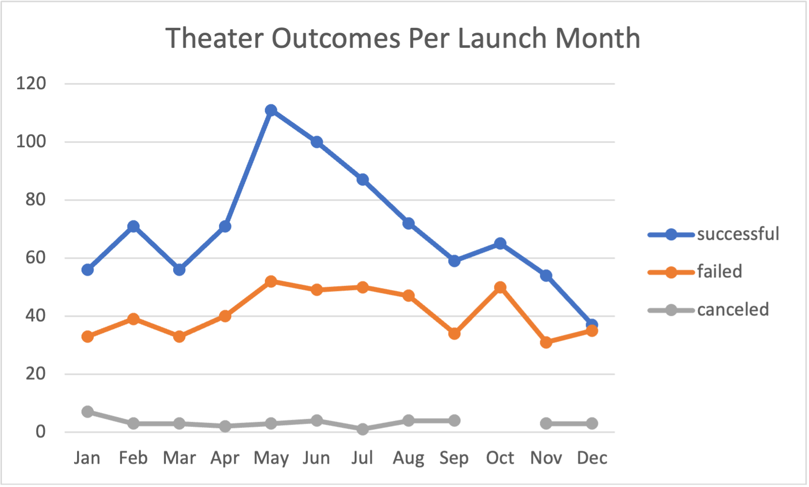
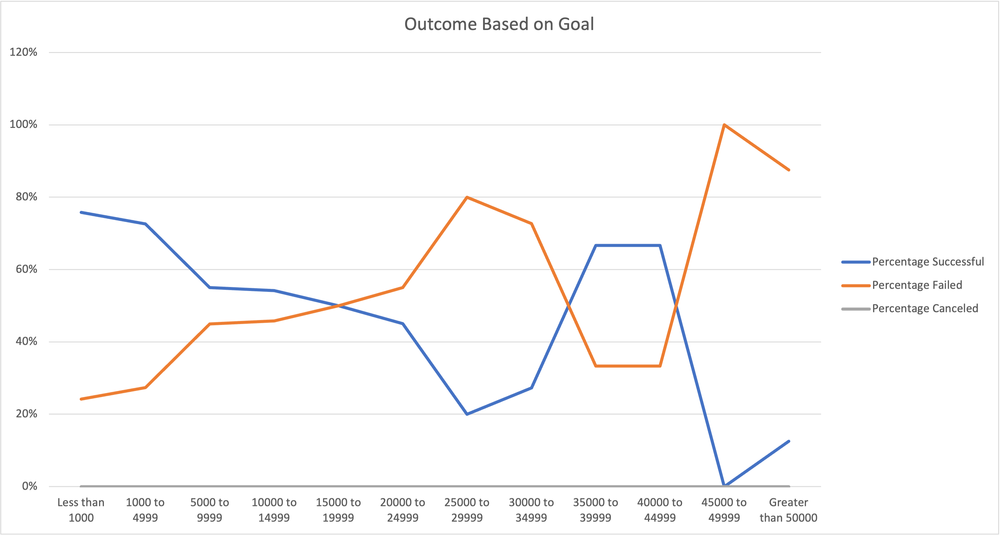

# Kickstarting with Excel

## Overview of Project
Data from a number of projects on Kickstater was acquired and compiled onto an Excel sheet. The investigator aims to to discover trends, if any, within the dataset as well as visualize those patterns.  

### Purpose
The purpose of this project was to utilize Excel and its vast functions to analyze data on various crownfunding campaigns in order to uncover general and specific trends.

## Analysis and Challenges

### Analysis of Outcomes Based on Launch Date
Within the original data set, all theater outcomes were selectively filtered to reveal trends based on the launch date. A pivot table displaying the number of successful, failed, and canceled theater campaigns launched in various months was then created. Concurrently, a line graph with markers for each month was derived from the pivot table and is shown below
 
The following observations were made:
Overall there seems to be an increase in launches during the beginning the month of April till August. 
- The most successful theater campaigns were launched in the month of May with the least successful having launched in December.
- The highest number of failed theater campaigns were reported in the months between May and August with highest being in May. October also reported similarly high failed theater campains. 
  - The lowest number of failed theater campaigns were recorded in November.
- The number of cancelled campaigns remained at relatively stable and low number throughout the year in question. 
  - The highest cancellations were recorded in the month of January while none were recorded in October.

### Analysis of Outcomes Based on Goals
Further analysis on the ouctomes of plays based on the campaign goal was needed. The amount of the goals was listed in ranges of 4999, with the lowest being less than 1000 and the highest at greater than 50000. The function 'COUNTIFS()' was utilized to pull the number of successful, failed, and cancelled projects corresponding to each range from the original data. The percentage of successful, failed, and cancelled prjects were then calculated by dividing the outcome of interest by the total number of projects within that goal. This was all recorded in a table and the resulting line graph was created as shown below. 

The following observations were made:
- The graphs representing the percentage of successful plays and the percentage of failed play seem to have an inverse relationship in which they cross three times.
- There were no play campaigns cancelled within the limits of this data set.
- 100% of plays with goals ranging between 45000-49999 failed.
- Nearly 80% of plays with goals less than 1000 were successful.
- 50% of plays with goals from 15000-19999 were sucessful.

### Challenges and Difficulties Encountered
In analyzing the outcomes based on goals, it was difficult to define the currency as they varied in the original data set. Each currency has a different value in comparison to the other and setting abstract ranges didn't really capture the reality of the goals within that country and globally. The data set requires further analysis filtered by country. 

## Results

- Launches for theater campaigns peak in the middle of the year with the most sucessful and the most failed campagns having being launched in May. It should be noted that successful theater campaigns doubled the number of failed theater campains. The number of successful theater campains launched later in the year follow a steady decline with the lowest number of successes in December. 

- High success can be reported in play projects with goals of 35000-44999. 

- This data set congregates data from all over the world. Though filtering allows each to be viewed separately, tables and visualizations created to view general trends fail to take into account these differences. Take for the example the chart labeled "Outcomes Based on Goals". It is difficult to identify which currency the ranges denote.

- The "Outcomes Based on Goals" pivot table could be further filtered by country. This would allow for a prospective investor to view a play campaigns viability based on region. Variability in these graphs can be attributed to local culture and climate. 

